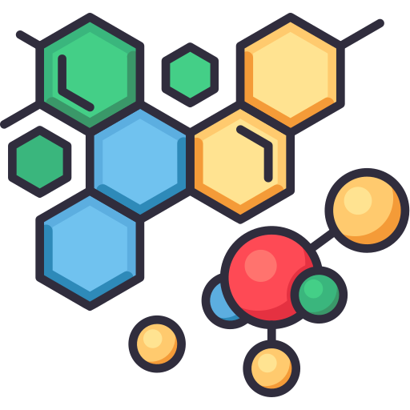

# NovoMolGen
*Foundation models for **de&nbsp;novo** small-molecule generation.*


---

## Abstract

> Designing \denovo molecules with desired property profiles requires efficient exploration of the vast chemical space ranging from $10^{23}$ to $10^{60}$ possible synthesizable candidates. While various deep generative models have been developed to design small molecules using diverse input representations, Molecular Large Language Models (Mol-LLMs) based on string representations have emerged as a scalable approach capable of exploring billions of molecules. However, there remains limited understanding regarding how standard language modeling practices such as textual representations, tokenization strategies, model size, and dataset scale impact molecular generation performance. In this work, we systematically investigate these critical aspects by introducing NovoMolGen, a family of transformer-based foundation models pretrained on 1.5 billion molecules for \denovo molecule generation. Through extensive empirical analyses, we identify a weak correlation between performance metrics measured during pretraining and actual downstream performance, revealing important distinctions between molecular and general NLP training dynamics. NovoMolGen establishes new state-of-the-art results, substantially outperforming prior Mol-LLMs and specialized generative models in both unconstrained and goal-directed molecular generation tasks, thus providing a robust foundation for advancing efficient and effective molecular modeling strategies.

🤗 **Checkpoints, tokenizers, and datasets:** [https://huggingface.co/collections/chandar-lab/novomolgen](https://huggingface.co/collections/chandar-lab/novomolgen-681bce8b0e73b5dc7a3b0ff1)

**Website:** [chandar-lab.github.io/NovoMolGen](https://chandar-lab.github.io/NovoMolGen/)


---


## Installation

```bash
# 1. Conda env with chemistry tool-chain
conda create -c conda-forge -c r -c msys2 -c lich -c hcc -n NovoMol \
 python=3.10 openbabel openmm pdbfixer rdkit syba xtb xtb-python crest \
 lightgbm=4.3.0 deepsmiles=1.0.1
conda activate NovoMol

# 2. Python deps
pip install -r requirements.txt

# 3. (Optional) Flash-Attention for faster training
export MAX_JOBS=4
export WORK_DIR = ?? #Set the working directory
FLASH_ATTN_VERSION='2.6.1'
NV_CC="8.0;8.6"
FLASH_ATTENTION_DIR="$WORK_DIR/flash-attention-v2"
git clone https://github.com/Dao-AILab/flash-attention "$FLASH_ATTENTION_DIR"
cd "$FLASH_ATTENTION_DIR"
git checkout "tags/v$FLASH_ATTN_VERSION"
TORCH_CUDA_ARCH_LIST="$NV_CC" MAX_JOBS="$MAX_JOBS" python setup.py install
cd csrc/fused_dense_lib && pip install .
cd ../xentropy && pip install .
cd ../rotary && pip install .
cd ../layer_norm && pip install .
cd ../  # Exit from csrc/rotary
cd ../  # Exit from flash-attention
```
Prerequisites: Python: 3.10+ , CUDA: 11.8

## Quick Start

### 1 · Tokenise a dataset (one-off)

```bash
python src/main.py tokenize_dataset \
    --config_name=ZINC_1B_smiles_atomwise 
```

### 2 · Pre-train

```bash
python src/main.py train \
    --config_name=train_ZINC_270M_atomwise
```

### 3 . Fine-tune for PMO task (REINVENT)

```bash
python src/main.py finetune \
    --config_name=finetune_PMO_ZINC_1B_atomwise_smiles_llama-32M 
```

## Code Structure  

- [`configs`](./configs): Contains YAML files for configuring **datasets, models, trainers, fine-tuning**.
- [`scripts`](./scripts): Bash helpers (environment setup, etc.).  
- [`notebooks`](./notebooks)
  - **[`checkpoint_quickstart.ipynb`](./notebooks/checkpoint_quickstart.ipynb)** – Quickstart: Loads the **NovoMolGen-32M** checkpoint + tokenizer from 🤗 Hub, samples **3k** SMILES, and evaluates the six unconstrained metrics. Renders a tidy dataframe mirroring Table 1.
  - **[`goal_directed_optimization.ipynb`](./notebooks/goal_directed_optimization.ipynb)** – Goal-directed demo: Runs a short **AugmentedHC/REINVENT** loop (e.g., `Perindopril_MPO`), logs rewards, and plots the training curve.
- [`src`](./src): **All Python source code**  
  - [`data_loader`](./src/data_loader): dataset & tokenization  *(see [`src/data_loader/README.md`](./src/data_loader/README.md))*  
  - [`models`](./src/models): all model classes and helpers used in NovoMolGen:
    - [`modeling_novomolgen.py`](./src/models/modeling_novomolgen.py): Flash-Attention Llama variant used as the **NovoMolGen** backbone.  
    - [`model_with_value_head.py`](./src/models/model_with_value_head.py): adds an MLP value-head for RL tasks (PPO).  
    - [`modeling_utils.py`](./src/models/modeling_utils.py): Inference helpers (`generate_valid_smiles`, etc.) that post-process raw generations into valid, canonical SMILES.
  - [`trainer`](./src/trainer): training & RL loops  
    - [`hf_trainer.py`](./src/trainer/hf_trainer.py): thin wrapper around `transformers.Trainer` with chemistry-specific callbacks.  
    - [`reinvent_trainer.py`](./src/trainer/reinvent_trainer.py): REINVENT implementation on top of NovoMolGen.  
    - [`augment_hc_trainer.py`](./src/trainer/augment_hc_trainer.py): Augmented-Hill-Climb trainer.  
    - *(see [`src/trainer/README.md`](./src/trainer/README.md))*  
  - [`eval`](./src/eval): goal-directed & unconstrained molecule metrics  
    - [`molecule_evaluation.py`](./src/eval/molecule_evaluation.py): computes validity, uniqueness, novelty, MPO tasks, docking wrappers, etc.  
    - *(see [`src/eval/README.md`](./src/eval/README.md))*  
  - [`callbacks`](./src/callbacks): logging & evaluation callbacks (e.g. WandB).  
  - [`REINVENT`](./src/REINVENT): **verbatim fork** of the original <https://github.com/MarcusOlivecrona/REINVENT>. kept only for result replication; our custom trainer lives in `src/trainer/reinvent_trainer.py`.  
  - `main.py`: single Fire-based CLI (`train`, `finetune`, `tokenize_dataset`).  

*(Jump into each sub-README for API docs, examples, and design notes.)*


## Citation

```bibtex
@misc{chitsaz2025novomolgenrethinkingmolecularlanguage,
      title={NovoMolGen: Rethinking Molecular Language Model Pretraining}, 
      author={Kamran Chitsaz and Roshan Balaji and Quentin Fournier and Nirav Pravinbhai Bhatt and Sarath Chandar},
      year={2025},
      eprint={2508.13408},
      archivePrefix={arXiv},
      primaryClass={cs.LG},
      url={https://arxiv.org/abs/2508.13408}, 
}
```
